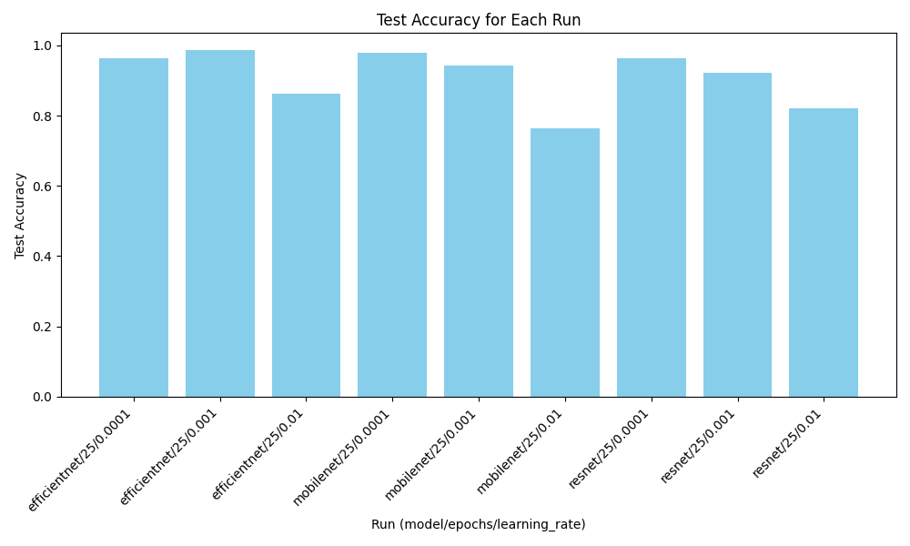
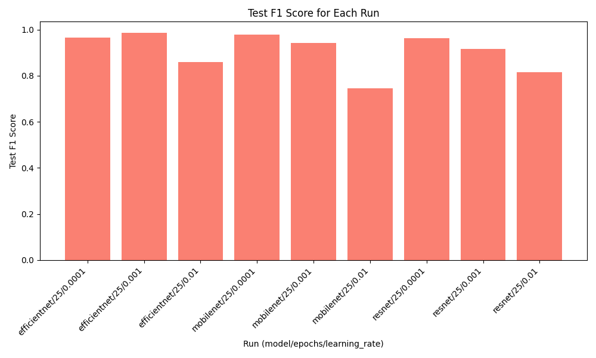

# Jute Dataset Image Classification

This pytorch project was a testing for most accurate image classification model for fine-tunning.
Those models have been tested:

-   [EfficientNet B0](https://docs.pytorch.org/vision/0.22/models/generated/torchvision.models.efficientnet_b0.html)
-   [ResNet 18](https://docs.pytorch.org/vision/main/models/generated/torchvision.models.resnet18.html)
-   [MobileNet V3](https://docs.pytorch.org/vision/main/models/mobilenetv3.html)

## Results

All models have been trained for 25 epochs. Multiple learning rates have been applied.

### Accuracy



### F1



## Local environment

This project uses [UV](https://github.com/astral-sh/uv) package manager.

```python
uv install
uv run main.py

# you can visualize results via tensorboard
uv run tensorboard --logdir=runs
```
